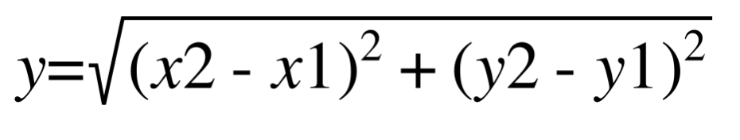

## Assignment 3

The Travelling Salesman Problem (TSP) is one of the most well know optimization problems. This problem originally is described as follows:

Given a list of cities and the distance between each other, which is the shortest route to travel across all the cities? , such that, you visit all the cities once and you start and finish in the same city.

We now consider the problem with a set of locations inside a city (you can find the document in the same folder in the blackboard and the name is Berlin52.tsp). These locations are represented by two coordinates (x and y) as illustrated in the table below.

| Location ID | X | Y  |
| :---: |:---:| :---:|
| 1 | 565 | 575 |
| 2 | 25 | 185 |
| 3 | 345 | 750 |
| ... | ... | ... |

The distance between two locations is the Euclidean Distance between the two locations:

Distance(P1,P2):

Your assignment now is to apply an optimization algorithm, e.g. Genetic Algorithm (GA) to search for the shortest route. You need to visit all the locations once and the starting and end points must be the location number 1.

Your report has to cover the key parts as follows:
1. Explain the important operations of the employed algorithm (e.g. GA) to solve this problem
2. Explain the representation of the individual solutions in your algorithm.
3. Give the equation of the fitness function used by your algorithm.
4. Give the parameters used in your algorithm. Examples: population size, crossover rate...
5. Illustrate how performance of the population evolves with generations (preferably with a figure)
6. Show the best result obtained by your algorithm (the order of locations to visit and the total distance of this route).

Before submitting the report, you should present this assignment first to Miguel Leon. After that, and only if everything is correct, you are able to send the report and the code to miguel.leonortiz@mdh.se
