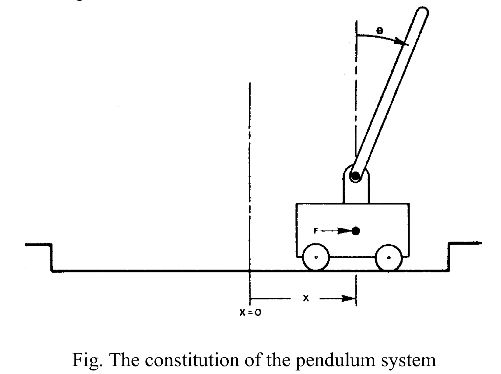
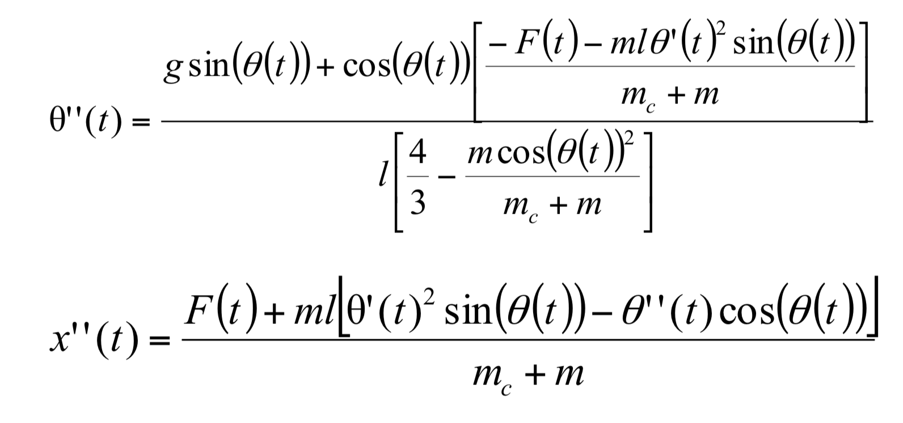

## Assignment 5
(Learning to control an inverted pendulum)

In this assignment you will apply the reinforcement learning technique to learn optimal action strategies for automatic control. The plant to be considered is an inverted pendulum system. The constitution of the pendulum system is depicted in the following figure, where a pole is hinged to a cart which moves on a rail to its right and left. The pole has only one degree of freedom to rotate around the hinge point. The controller can apply a “left” or “right” force of fixed magnitude to the cart at discrete time intervals.

The states of the pendulum system are:
1. position of the cart (x),
2. angle of the pole (θ),
3. cart velocity on the rail (x'),
4. speed of pole rotation (θ')

We can use such states to describe the behaviour of the system as a set of non-linear differential equations as

Where

**g** = -9.8 m/s2, acceleration due to gravity mc = 10 kg, mass of the cart 
**m** = 0.1 kg, mass of the pole 
**l** = 0.5m, half of the pole length 
**F(t)** = +10 or -10 newtons, force applied to cart’s mass center at time t.

The system survives if the cart position is within [-2.4 m, 2.4 m] and pole angle is not more than 12 degrees. Suppose the initiate state of the system is (x=0, x’=0, θ=0, θ’=0) and the discrete time interval is 0.02 second. Now your task is to use the reinforcement learning method to learn the best strategy of selecting forces such that the survival time of the system is maximized.

In order to get response of the system by applying a force under a state, you have to do simulation of the real plant in terms of the system equations given above. A simulation function in MATLAB code is available from the “Labs” folder. But you have to program the simulation function if you use other languages in this assignment.

Your report has to clarify your approach and results by covering the following issues:
1) How do you characterize (discretize) states of the world in this learning task?
2) What is the reward function designed?
3) What is the function to be learned?
4) What learning algorithm is used?
5) How do you choose exploratory actions?
6) How many intervals can your system survive by using the learned strategy?
